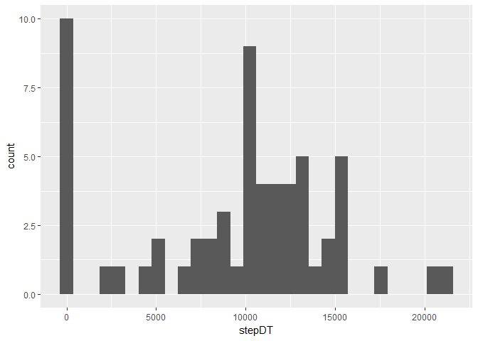
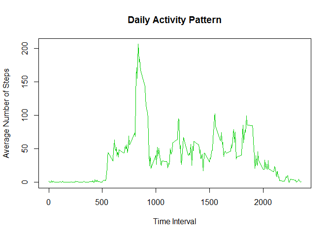
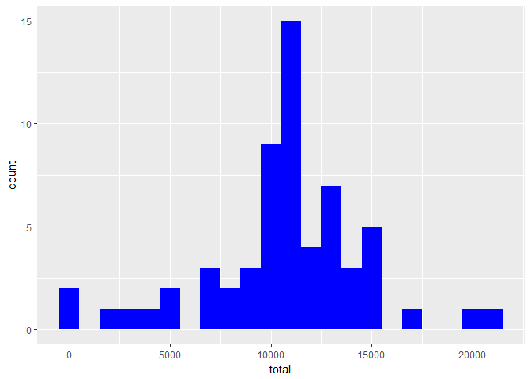
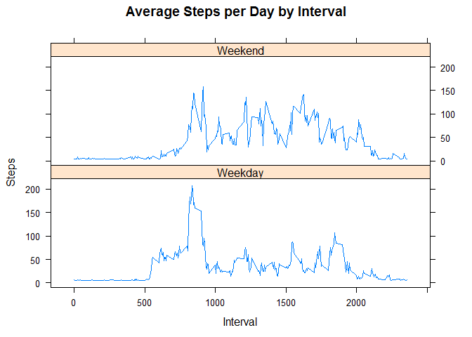

# Reproducible Research Week 2
Juan Q.  
July 17, 2017  

I'll cleanse, sort and plot the data from a personal activity monitoring device. I'll also investigate the pattern of activities between weekdays and weekends.


## 1. Loading the Data


```r
activityDT <-data.table::fread(input = "activity.csv")
```

## 2. What is mean total number of steps taken per day?


```r
stepDT <- with(activityDT, tapply(steps, date, sum, na.rm = TRUE))
qplot(stepDT)
```

<!-- -->

```r
summary(stepDT)
```

```
##    Min. 1st Qu.  Median    Mean 3rd Qu.    Max. 
##       0    6778   10395    9354   12811   21194
```

The mean of the total number of steps: 9354.

The median of the total number of steps: 10395.

## 3. What is the average daily activity pattern?

To get the average daily activity pattern, data must first be cleansed, and aggreated.


```r
noNADT <- na.omit(activityDT)

##Aggregate steps by intervals
actSteps <- aggregate(noNADT$steps, list(as.numeric(noNADT$interval)), FUN="mean")

names(actSteps) <- c("interval","mean")

plot(actSteps, type="l", xlab="Time Interval", ylab="Average Number of Steps", main="Daily Activity Pattern", col=3)
```

<!-- -->

The 5-minute interval contains the maximum number of steps is:


```r
actSteps$interval[ which.max(actSteps$mean)]
```

```
## [1] 835
```

##4. Imputing missing values

By using the following function, I found out the the total number of missing values in the dataset is:

```r
sum(is.na(activityDT$steps)) 
```

```
## [1] 2304
```

This will affect my analysis for activity patterns. I'll use the daily mean to fill up missing data:


```r
##Create a vector with NA steps
naSteps <- which(is.na(activityDT$steps))

##Create a mean vector
meanVec <- rep(mean(activityDT$steps, na.rm=TRUE), times=length(naSteps))

# Replace the NAs by the means vector
activityDT[naSteps, "steps"] <- meanVec
```

```
## Warning in `[<-.data.table`(`*tmp*`, naSteps, "steps", value =
## c(37.3825995807128, : Coerced 'double' RHS to 'integer' to match the
## column's type; may have truncated precision. Either change the target
## column to 'double' first (by creating a new 'double' vector length 17568
## (nrows of entire table) and assign that; i.e. 'replace' column), or coerce
## RHS to 'integer' (e.g. 1L, NA_[real|integer]_, as.*, etc) to make your
## intent clear and for speed. Or, set the column type correctly up front when
## you create the table and stick to it, please.
```

```r
#aggregate data of steps by each day
finalDT <- aggregate(activityDT$steps, by=list(activityDT$date), FUN=sum)

names(finalDT) <- c("date", "total")
```

The histogram of the total number of steps taken each day after data imputing:

```r
ggplot(finalDT, aes(x=total)) + 
  geom_histogram(fill = "blue", binwidth = 1000)
```

<!-- -->

The mean and median of steps are as follows, which are different compared with the results from the original data:

```r
summary(finalDT)
```

```
##      date               total      
##  Length:61          Min.   :   41  
##  Class :character   1st Qu.: 9819  
##  Mode  :character   Median :10656  
##                     Mean   :10752  
##                     3rd Qu.:12811  
##                     Max.   :21194
```


##5. Are there dierences in activity patterns between weekdays and weekends?


```r
weekdays <- c("Monday", "Tuesday", "Wednesday", "Thursday", 
              "Friday")
activityDT$dow = as.factor(ifelse(is.element(weekdays(as.Date(activityDT$date)),weekdays), "Weekday", "Weekend"))

averageSteps <- aggregate(steps ~ interval + dow, activityDT, mean)

xyplot(averageSteps$steps ~ averageSteps$interval|averageSteps$dow, main="Average Steps per Day by Interval",xlab="Interval", ylab="Steps",layout=c(1,2), type="l")
```

<!-- -->
